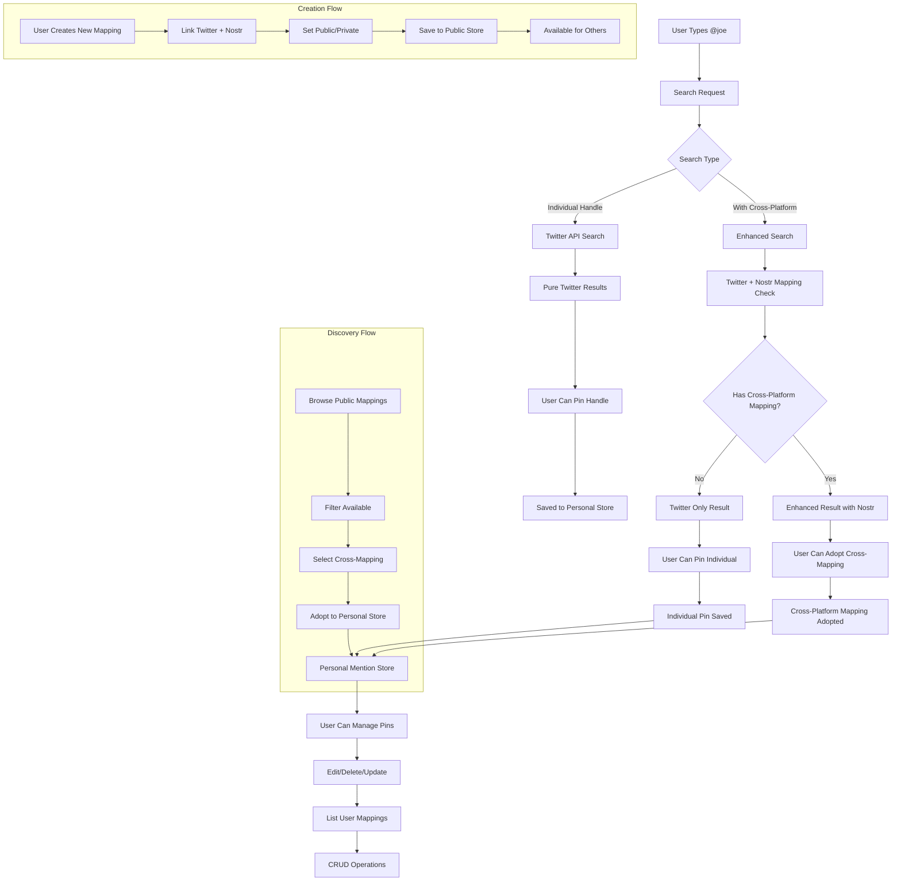

# Mention Mapping Lifecycle & API Routes

## 🔄 Full Lifecycle Flow



## 🔍 Search Flow Details

### Individual Handle Search
```
1. User searches "@joe"
2. Twitter API returns: [@joe, @joebiden, @joerogan]
3. User sees clean Twitter results
4. User can pin any handle → saved to personal store
```

### Cross-Platform Enhanced Search
```
1. User searches "@joe"  
2. Twitter API returns: [@joe, @joebiden, @joerogan]
3. System checks for Nostr mappings:
   - @joerogan ↔ npub1abc... (95% confidence, 1247 uses)
   - @joebiden ↔ npub1def... (88% confidence, 892 uses)
4. Results show "🔗 Has Nostr mapping" indicator
5. User can:
   - Pin individual handle (Twitter only)
   - Adopt cross-platform mapping (Twitter + Nostr)
```

## 📊 Data Flow Architecture

### Personal Store (User.mention_preferences)
```javascript
{
  pinned_mentions: [
    {
      id: "pin_123",
      label: "Joe Rogan",
      twitter_profile: { username: "joerogan", ... },
      nostr_profile: null, // Individual pin
      is_cross_platform: false,
      usage_count: 15
    },
    {
      id: "cross_456", 
      label: "Elon Musk (Cross-platform)",
      twitter_profile: { username: "elonmusk", ... },
      nostr_profile: { npub: "npub1...", ... },
      is_cross_platform: true,
      source_mapping_id: "mapping_789",
      mapping_confidence: 0.92
    }
  ]
}
```

### Public Mapping Store (SocialProfileMappings)
```javascript
{
  mapping_key: "elonmusk|npub1xyz",
  twitter_profile: { username: "elonmusk", ... },
  nostr_profile: { npub: "npub1xyz...", ... },
  is_public: true,
  confidence_score: 0.92,
  created_by: "mapper@example.com",
  usage_count: 2847,
  verification_method: "verified_link"
}
```

## 🛠 Complete API Routes

### Search & Discovery Routes
```javascript
// Enhanced search with cross-platform mapping detection
POST /api/mentions/search
{
  "query": "joe",
  "include_cross_mappings": true,
  "max_results": 10
}

// Browse public cross-platform mappings
GET /api/mentions/discover
?page=1&limit=20&search=joe&sort=popular

// Get specific mapping details
GET /api/mentions/mapping/:mappingId
```

### Personal Mention Management Routes
```javascript
// Get user's pinned mentions
GET /api/mentions/pins
?type=all|individual|cross_platform

// Add individual Twitter handle pin
POST /api/mentions/pins
{
  "twitter_username": "joerogan",
  "custom_label": "Joe Rogan Podcast"
}

// Adopt cross-platform mapping
POST /api/mentions/adopt-cross-mapping
{
  "mapping_id": "60f7b3b9e1b2c3d4e5f6a7b8",
  "custom_label": "Elon Musk (Cross-platform)"
}

// Update existing pin
PUT /api/mentions/pins/:pinId
{
  "custom_label": "Updated Label",
  "personal_notes": "My notes"
}

// Delete pin
DELETE /api/mentions/pins/:pinId

// Get pin usage statistics
GET /api/mentions/pins/:pinId/stats
```

### Cross-Platform Mapping Creation Routes
```javascript
// Create new cross-platform mapping
POST /api/mentions/mappings
{
  "twitter_username": "joerogan",
  "nostr_npub": "npub1abc123...",
  "verification_method": "manual",
  "is_public": true,
  "confidence_score": 0.95
}

// Get user's created mappings
GET /api/mentions/mappings/created

// Update mapping
PUT /api/mentions/mappings/:mappingId
{
  "confidence_score": 0.98,
  "verification_method": "verified_link"
}

// Delete mapping (only if creator)
DELETE /api/mentions/mappings/:mappingId
```

### Community Features Routes
```javascript
// Vote on public mapping quality
POST /api/mentions/mappings/:mappingId/vote
{
  "vote": "up" | "down"
}

// Report mapping as incorrect
POST /api/mentions/mappings/:mappingId/report
{
  "reason": "incorrect_mapping",
  "details": "This is not the right person"
}

// Get mapping verification status
GET /api/mentions/mappings/:mappingId/verification
```

## 📱 Frontend UX Flow

### Search Results UI
```
🔍 Search: "@joe"

Results:
┌─────────────────────────────────────────────────────┐
│ @joe                                      [📌 Pin]  │
│ Joe Smith • 1.2K followers                          │
└─────────────────────────────────────────────────────┘

┌─────────────────────────────────────────────────────┐
│ @joerogan                    🔗 Has Nostr mapping   │
│ Joe Rogan • 15.2M followers • Verified             │
│ [📌 Pin Individual] [🔗 Adopt Cross-Mapping]       │
└─────────────────────────────────────────────────────┘
```

### User's Pins Management UI
```
📌 My Pinned Mentions (15)

Individual Pins (8):
┌─────────────────────────────────────────────────────┐
│ @joebiden                           Used 23 times   │
│ Joe Biden • 38M followers                    [Edit] │
└─────────────────────────────────────────────────────┘

Cross-Platform Mappings (7):
┌─────────────────────────────────────────────────────┐
│ @joerogan ↔ npub1abc...             Used 45 times   │
│ Joe Rogan (Cross-platform) • 95% confidence [Edit]  │
└─────────────────────────────────────────────────────┘
```

## 🎯 Key User Journeys

### Journey 1: Individual Handle Pin
1. Search "@joerogan"
2. See Twitter result  
3. Click "📌 Pin Individual"
4. Handle saved to personal store
5. Next search shows pinned result first

### Journey 2: Cross-Platform Mapping Discovery & Adoption
1. Search "@joerogan"
2. See "🔗 Has Nostr mapping" indicator
3. Click "🔗 Adopt Cross-Mapping"
4. Both Twitter + Nostr profiles saved
5. Can now cross-post between platforms

### Journey 3: Creating New Cross-Platform Mapping
1. User knows @elonmusk = npub1xyz...
2. Navigate to "Create Mapping"
3. Link Twitter + Nostr profiles
4. Set as public for others to discover
5. Mapping becomes available community-wide

### Journey 4: Managing Personal Pins
1. Go to "My Pins" page
2. See individual pins + cross-platform mappings
3. Edit labels, add notes
4. Delete unused pins
5. View usage statistics

This complete lifecycle enables users to build their personal mention libraries while contributing to and benefiting from community-driven cross-platform mappings.

## 📚 Glossary of Terms

### Core Identifiers
- **`pinId`**: Unique identifier for a user's personal pinned mention (e.g., `"pin_123"`, `"cross_456"`)
  - Format: `"pin_" + timestamp` for individual pins, `"cross_" + mappingId + "_" + timestamp` for adopted mappings
  - Scope: Personal to each user's mention store
  - Purpose: CRUD operations on user's personal pins

- **`mappingId`**: MongoDB ObjectId for a public cross-platform mapping record
  - Format: `"60f7b3b9e1b2c3d4e5f6a7b8"` (24-character hex string)
  - Scope: Global across all users
  - Purpose: Reference public mappings for adoption, voting, reporting

- **`mapping_key`**: Compound unique identifier for cross-platform relationships
  - Format: `"twitter_username|nostr_npub"` (e.g., `"joerogan|npub1abc123def456"`)
  - Scope: Global uniqueness constraint
  - Purpose: Prevent duplicate mappings, fast lookups

### Platform Identifiers
- **`npub`**: Nostr public key in bech32 format
  - Format: `"npub1"` followed by 58 characters (e.g., `"npub1abc123def456ghi789jkl012mno345pqr678stu901vwx234yz567"`)
  - Purpose: Nostr user identification

- **`twitter_id`**: Twitter's internal numeric user ID
  - Format: Numeric string (e.g., `"12345678901234567890"`)
  - Purpose: Permanent Twitter user identification (doesn't change with username changes)

- **`twitter_username`**: Twitter handle without @ symbol
  - Format: Alphanumeric string (e.g., `"joerogan"`)
  - Purpose: Human-readable Twitter identification

### Mapping Types
- **Individual Pin**: User's personal bookmark of a Twitter handle only
  - `is_cross_platform: false`
  - `nostr_profile: null`
  - Purpose: Quick access to frequently mentioned Twitter users

- **Cross-Platform Mapping**: Verified relationship between Twitter and Nostr accounts
  - `is_cross_platform: true`
  - Contains both `twitter_profile` and `nostr_profile`
  - Purpose: Enable cross-posting between platforms

- **Adopted Mapping**: User's personal copy of a public cross-platform mapping
  - `is_adopted: true`
  - `source_mapping_id: "mappingId"`
  - Purpose: Personal curation of community-verified mappings

## 🎯 Confidence Score Calculation

### Base Confidence Factors

#### 1. Verification Method (Weight: 40%)
```javascript
const verificationScores = {
  'verified_link': 1.0,      // 100% - Official link verification
  'cross_post': 0.85,        // 85% - Analyzed cross-posting patterns
  'community': 0.70,         // 70% - Community consensus
  'manual': 0.50             // 50% - Manual claim by user
};
```

#### 2. Community Validation (Weight: 30%)
```javascript
const calculateCommunityScore = (upvotes, downvotes) => {
  const totalVotes = upvotes + downvotes;
  if (totalVotes === 0) return 0.5; // Neutral baseline
  
  const approval = upvotes / totalVotes;
  const confidence = Math.min(1.0, totalVotes / 10); // Confidence increases with more votes
  
  return approval * confidence + 0.5 * (1 - confidence);
};
```

#### 3. Usage Patterns (Weight: 20%)
```javascript
const calculateUsageScore = (usageCount, daysSinceCreation) => {
  const dailyUsage = usageCount / Math.max(1, daysSinceCreation);
  
  if (dailyUsage >= 10) return 1.0;    // Very high usage
  if (dailyUsage >= 5) return 0.9;     // High usage
  if (dailyUsage >= 1) return 0.8;     // Regular usage
  if (dailyUsage >= 0.1) return 0.6;   // Occasional usage
  return 0.3;                          // Low usage
};
```

#### 4. Creator Reputation (Weight: 10%)
```javascript
const calculateCreatorScore = (creatorEmail) => {
  // Based on creator's mapping history
  const creatorStats = getUserMappingStats(creatorEmail);
  
  const accuracyScore = creatorStats.approvedMappings / creatorStats.totalMappings;
  const experienceScore = Math.min(1.0, creatorStats.totalMappings / 50);
  
  return (accuracyScore * 0.7) + (experienceScore * 0.3);
};
```

### Final Confidence Calculation
```javascript
const calculateConfidenceScore = (mapping) => {
  const verificationScore = verificationScores[mapping.verification_method] || 0.5;
  const communityScore = calculateCommunityScore(mapping.upvotes, mapping.downvotes);
  const usageScore = calculateUsageScore(mapping.usage_count, mapping.daysSinceCreation);
  const creatorScore = calculateCreatorScore(mapping.created_by);
  
  const finalScore = (
    (verificationScore * 0.40) +
    (communityScore * 0.30) +
    (usageScore * 0.20) +
    (creatorScore * 0.10)
  );
  
  // Apply decay factor for very old mappings
  const ageDecay = Math.max(0.8, 1 - (mapping.daysSinceCreation / 730)); // 2 years
  
  return Math.round(finalScore * ageDecay * 100) / 100; // Round to 2 decimal places
};
```

### Confidence Score Meanings
- **0.95-1.00**: Verified official connection (blue checkmark equivalent)
- **0.85-0.94**: High confidence, community validated
- **0.70-0.84**: Good confidence, some validation
- **0.50-0.69**: Moderate confidence, limited validation
- **0.30-0.49**: Low confidence, needs more validation
- **0.00-0.29**: Very low confidence, likely incorrect

### Real-World Examples

#### Example 1: High Confidence Mapping
```javascript
{
  twitter_username: "joerogan",
  verification_method: "verified_link", // 1.0
  upvotes: 45, downvotes: 2,           // ~0.95 community score
  usage_count: 1247, age_days: 120,    // ~0.9 usage score
  creator_reputation: 0.85,            // Experienced mapper
  final_confidence: 0.94               // Very high confidence
}
```

#### Example 2: Low Confidence Mapping
```javascript
{
  twitter_username: "someuser",
  verification_method: "manual",       // 0.5
  upvotes: 1, downvotes: 3,           // ~0.25 community score
  usage_count: 5, age_days: 300,      // ~0.3 usage score
  creator_reputation: 0.4,            // New mapper
  final_confidence: 0.32              // Low confidence
}
```

### Confidence Updates
- **Real-time**: Community votes immediately update confidence
- **Daily**: Usage patterns recalculated
- **Weekly**: Creator reputation scores updated
- **Monthly**: Age decay applied to older mappings

This system ensures that high-quality, verified mappings rise to the top while questionable mappings are clearly marked with low confidence scores. 